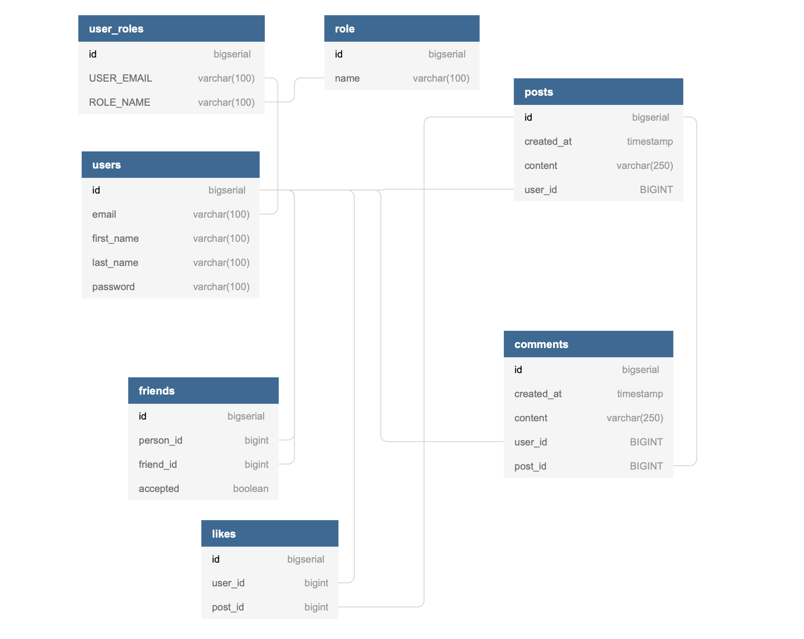

## Acebook

A Facebook clone, for a bootcamp challenge,  which we developed in two weeks without much prior knowledge of the below technologies.

### Stack

  - `maven` to build the project
  - `webpack` to bundle the javascript
  - `thymeleaf` to serve `index.html`
  - `react` to make requests to the api and render the component views
  - `flyway` to manage `postgresql` db migrations
  - `junit` to test
  - `java` to develop back-end
  - `spring boot`
  - `intellij` text editor for `java`

### Card wall

<a href="https://trello.com/b/ZxdzZhwn/acebook-super-team"> Team's Trello Board</a> 

### Database Schema

Flyway is being used to manage database migrations. All required SQL files are located in `/resources/db/migration`  
Here's the database schema:

### Features

- Signup/Login/Logout
- Password encryption
- Unique Newsfeed for every user
- Add/Remove posts
- Add/Remove comments
- Add/Remove friends (Friend Requests)
- Add/Remove likes
- Timestamped posts & comments

### Learning Journey

At first, we discussed and agreed on our Minimum Viable Product(MVP) idea.
We didn't have much prior knowledge about the required technologies, so our approach was to dedicate first week to learn as much as possible and develop an MVP in the second week.
This approach proved to be successful as we managed to deliver the above features in a very short period of time.

### Try it!

Want to see & try our app? Here's how:
- Clone this repo using `git clone`
- Install Maven `brew install maven`
- From the command line create a dev database `createdb acebook_springboot_development` 
(if you're not using `postgresql` make sure you amend `application.properties` file to suit your database)
- Build the app and start the server, using the Maven command `mvn spring-boot:run`
- Visit `localhost:8080`
